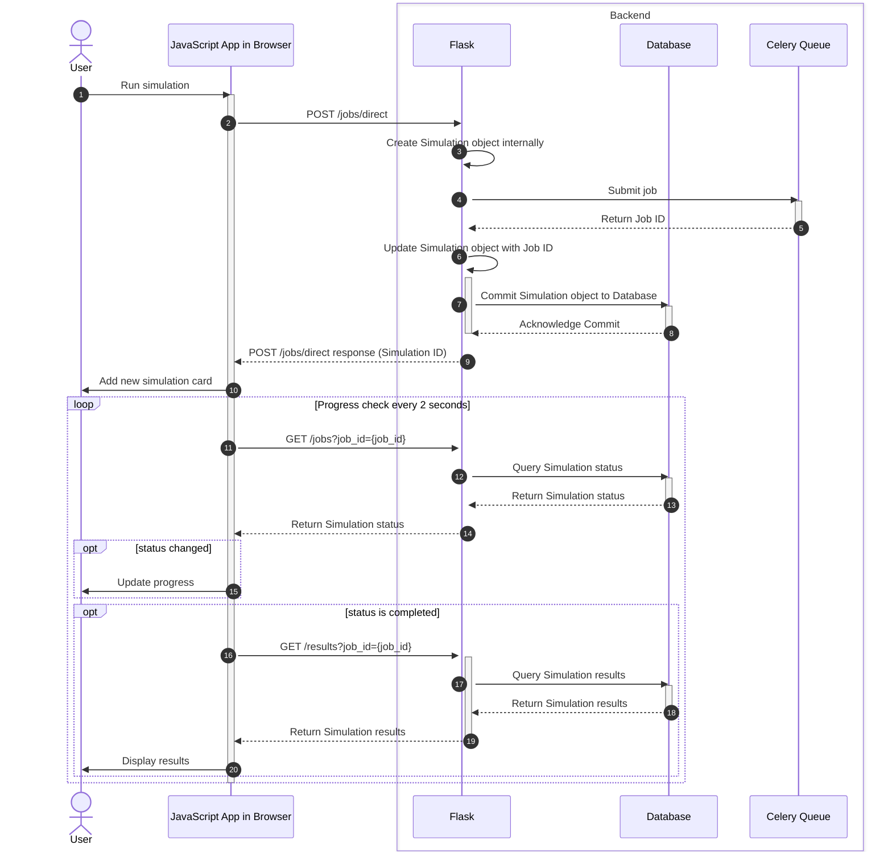
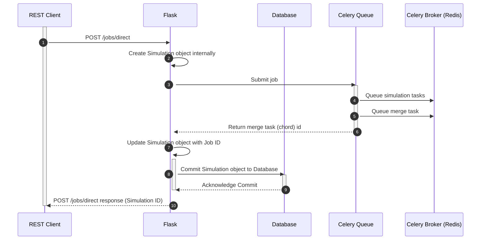
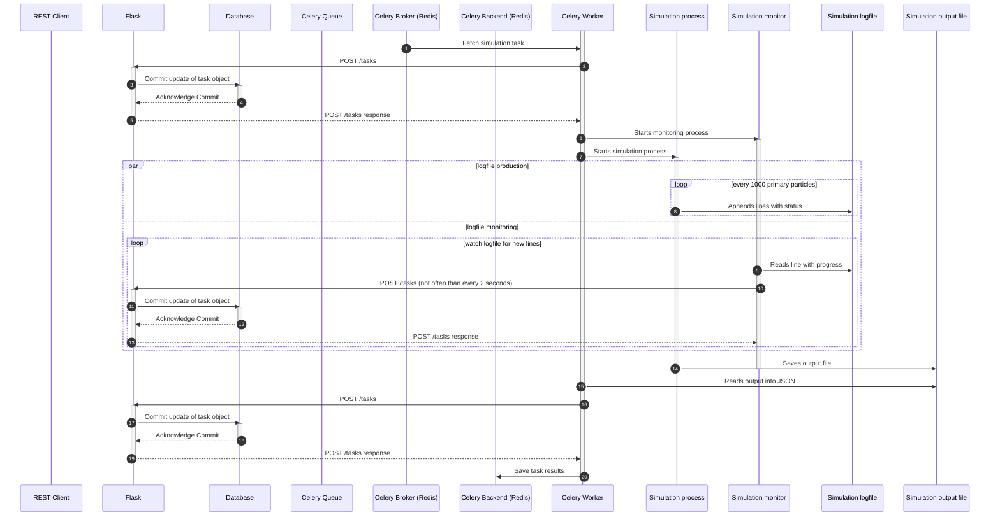

# Sequence diagrams

## Overview of run simulation sequence

This is scenario used when direct job submission is used and simulation job is executed in Celery worker.

### Job submission in more details

Single task execution:

